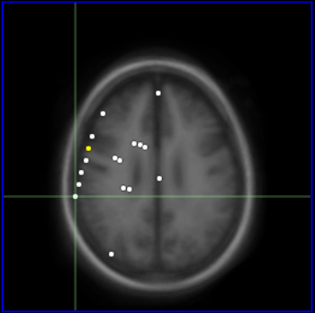
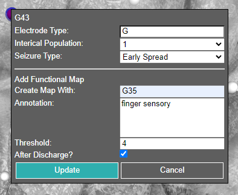

<!-- omit in toc -->
# N-Tools Browser
**Web-based Electrode Visualization**

An update of the original [N-Tools Browser](https://github.com/jingyunc/ntools_browser), based on [XTK](https://github.com/xtk/X).

<a href='./Docs/NYU-Final-Documentation.pdf'>Final Documentation</a>

<!-- omit in toc -->
## **Contents**
<details>
<summary>User Walkthrough</summary>

- [1. User Walkthrough](#1-user-walkthrough)
  - [1.1. Loading a Subject for Demo](#11-loading-a-subject-for-demo)
  - [1.2. Main Screen](#12-main-screen)
  - [1.3. 2D Slice Renderers](#13-2d-slice-renderers)
    - [1.3.1. Controls](#131-controls)
  - [1.4. 2D Slice Settings](#14-2d-slice-settings)
  - [1.5. Electrode and Functional Map Editing](#15-electrode-and-functional-map-editing)
  - [1.6. Electrode Signal View](#16-electrode-signal-view)
</details>

<details>
<summary>Instructions For Using N-Tools With Your Own Data</summary>

- [2. Instructions For Using N-Tools With Your Own Data](#2-instructions-for-using-n-tools-with-your-own-data)
  - [2.1. Files Needed](#21-files-needed)
  - [2.2. Option 1. Place your files into the local project directory as so.](#22-option-1-place-your-files-into-the-local-project-directory-as-so)
  - [2.3. Option 2. Update the URLs](#23-option-2-update-the-urls)

</details>

<details>
<summary>For Future Developers</summary>

- [3. For Future Developers](#3-for-future-developers)
</details>

<details>
<summary>Miscellaneous</summary>

- [4. Publications](#4-publications)
- [5. Affiliations](#5-affiliations)
- [6. Acknowledgements](#6-acknowledgements)
</details>

## 1. User Walkthrough

Go to the Github and search for github pages or click on this [link](https://ntoolsbrowser.github.io/).  

To demo the software, no installation is required. We have three samples to choose from using the drop down menu shown below

### 1.1. Loading a Subject for Demo


After the loading page you can interact with the patient's data represented on a 3D brain mesh.

### 1.2. Main Screen


Electrodes can be selected by either clicking with the mouse, or using the 'Select Electrode' menu. Different functional mappings and seizure types can be selected with the 'Seizure Type' and 'Functional Map' menus.

### 1.3. 2D Slice Renderers



A 2D renderer for each axis will be drawn at the bottom of the screen.

#### 1.3.1. Controls
- **Click+Drag** to move the slices to a different location
- **Scroll Wheel** to cycle between images
- **Ctrl+Scroll Wheel** to change image size
- **Double Click** to reset them back to their original position and size

### 1.4. 2D Slice Settings

To control the brightness and contrast of the 2D image, the sliders at the bottom of the screen can be used. Low window and high window work by changing anything below the value of window low to black and anything above the value of window high to white. You can also adjust the current image of the three axes here rather than using the scroll wheel.

The sync slices button will jump all images back to the image containing the current selected electrode.


### 1.5. Electrode and Functional Map Editing



The edit menu is activated by right clicking an electrode. The menu can be moved by clicking and dragging. At this time, the user must ensure that a functional mapping category is selected from the menu on the left panel. Left clicking on a new electrode will close the edit menu.

### 1.6. Electrode Signal View

The user can start the play back of all electrode signals by pushing the 'play/stop' button under the 'Electrode Signal' folder in the UI.


The playback of the electrode signal is viewed as electrode color change. 
For any given time stamp in the playback the color red indicates the highest value at that time stamp while the color blue indicates the lowest value for the electrode signal at that time stamp.
All other colors fall in between.


The user also has the ability to see the electrode signal as a wave form by clicking on the 'sin wave' button.


The user can scroll by moving the mouse to the bottom of the window and the horizontal scroll bar will appear. Or if there is a mouse pad drag 2 fingers on the mouse pad to scroll left or right the viewing window on the electrode signal.

As the scrolling of the sin wave happens the 3D view will update the electrode colors to the current scrolled to time stamp.

For the user to see the next electrode signal as a 'sin wave', he/she must press the arrow down on the keyboard to move to the next signal wave. Pressing arrow up displays the previous signal wave.

## 2. Instructions For Using N-Tools With Your Own Data

Advanced users who wish to adapt N-Tools Browser for their own use will first need to download the repository. This can be done either by downloading the repository as a zip file or using:

    $ git clone https://github.com/ntoolsbrowser/ntoolsbrowser.github.io.git

### 2.1. Files Needed

You will need the following files:

1. A NIfTI (.nii) file, for the patient brain scan.
2. Two .pial meshes, for the left and right hemispheres.
3. A JSON file containing the coordinates and electrode IDs for the patient. An example of a JSON can be found [here](https://github.com/ntoolsbrowser/ntoolsbrowser.github.io/blob/main/data/blank/JSON/blank.json).
4. A `.edf` containing electrode signal data.

To convert the `.edf` into a signal header json and `.bin` file, you can run the following script found in the [preprocessing folder](https://github.com/ntoolsbrowser/ntoolsbrowser.github.io/tree/main/preprocessing/edfToJson.py).

    $ python edfToJson.py myFile.edf

A JSON for the electrode IDs and coordinates can be generated by hand or from existing data. The [preprocessing folder](https://github.com/ntoolsbrowser/ntoolsbrowser.github.io/tree/main/preprocessing/edfToJson.py) contains many examples for transforming data from `.txt` and `.xlsx` files. For example, if one has a `.txt` file containing entries such as 

```
id1 xCoor1 yCoor1 zCoor1
id2 xCoor2 yCoor2 zCoor2

...

idN xCoorN yCoorN zCoorN
```

the script [`genblank.py`](https://github.com/ntoolsbrowser/ntoolsbrowser.github.io/tree/main/preprocessing/edfToJson.py) can create a JSON file for the coordinates.

    $ python genblank.py myFile.txt

Similar simple scripts can be created for other file formats, such as `.csv`

### 2.2. Option 1. Place your files into the local project directory as so.


Replace 'subject' with the actual subject ID.

```
data
└───subject
    └───edf
    |   | subject_signal_header.json
    |   └───signals
    |       | subject.bin
    └───JSON
    |   | subject.json
    └───meshes
    |   | subject_lh.pial
    |   | subject_rh.pial
    └───volume
        | subject_T1.nii
```
### 2.3. Option 2. Update the URLs

[`main.js`](https://github.com/ntoolsbrowser/ntoolsbrowser.github.io/blob/main/main.js) and [`electrodes.js`](https://github.com/ntoolsbrowser/ntoolsbrowser.github.io/blob/main/js/electrodes.js) contain code that handles the files above.
Currently, the URLs in these files are pointing to NYU's server. If you have your own URL where you store files, this can be easily changed.

For file naming conventions, we have worked to comply to the [BIDS specification](https://bids-specification.readthedocs.io/en/stable/01-introduction.html). The naming conventions we have used are as follows:

- `?bids=ana&file=sub-subject_freesurferleft.pial`
- `?bids=ana&file=sub-subject_freesurferright.pial`
- `?bids=ana&file=sub-subject_preoperation_T1w.nii`
- `?bids=ieeg&file=sub-subject_ntoolsbrowser.json`
- `?bids=ieeg&file=sub-subject_functionalmapping.json`
- `?bids=ieeg&file=sub-subject_functionalmapping.bin`
## 3. For Future Developers

You can find information about some of the weirder parts of the code that were too big to fit in comments [here](https://github.com/ntoolsbrowser/ntoolsbrowser.github.io/blob/main/Docs/futuredevs.md)
## 4. Publications

**N-Tools-Browser: Web-Based Visualization of Electrocorticography Data for Epilepsy Surgery**. Frontiers in Bioinformatics, April 2022. [Link](https://www.frontiersin.org/articles/10.3389/fbinf.2022.857577/full).

## 5. Affiliations

[UMass Boston](https://www.umb.edu/)

[NYU Langone Comprehensive Epilepsy Center](https://nyulangone.org/locations/comprehensive-epilepsy-center)


## 6. Acknowledgements

Special thank you to [Jingyun Chen](https://med.nyu.edu/faculty/jingyun-chen), [Daniel Friedman](https://nyulangone.org/doctors/1407900152/daniel-friedman), and [Daniel Haehn](https://danielhaehn.com/)! This project could would not have been successful without your support. 


