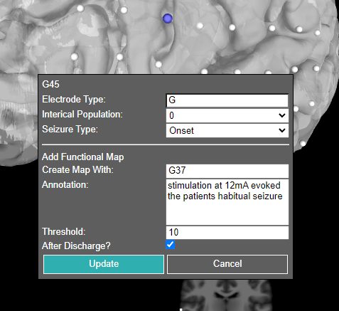

# N-Tools Browser
<!-- please add a more high-level documentation to your github if appropriate, this should tell ppl how to use the software or access it and describe it a little bit -->
**Web-based Electrode Visualization**

<!-- An add-on to [ntools_elec](https://github.com/HughWXY/ntools_elec), based on [XTK](https://github.com/xtk/X). -->

An update of the original [N-Tools Browser](https://github.com/jingyunc/ntools_browser), based on [XTK](https://github.com/xtk/X).
<!--  -->

<!--  -->

<!--  -->

## User Walkthrough:
-  Go to the Github and search for github pages or click on this [link](https://ntoolsbrowser.github.io/).
-  For demoing, we have three samples to choose from using the drop down menu shown below


-  After the loading page you can interact with the patient's data represented on a 3D brain mesh.


### Electrode editing attribute:
- To edit the attribute or to mark the electrodes according to the elipsey level. Do right click of the mouse to get the table for updation of seziure type or electrode type



### Electrode signal view:

The user can start the play back of all eletrode signals by pushing the 'play/stop' button under the 'Eletrode Signal' folder in the UI


The playback of the electrode signal is viewed as electrode color change. 
For any given time stamp in the playback the color red indicates the highest value at that time stamp while the color blue indicates the lowest value for the eletrode signal at that time stamp.
All other colors fall in between.


The user also has the ability to see the eletrode signal as a wave form by clicking on the 'sin wave' button

The user can scroll by moving the mouse to the bottom of the window and the horizontal scroll bar will appear. Or if there is a mouse pad drag 2 fingers on the mouse pad to scroll left or right the viewing window on the electrode signal.

As the scrolling of the sin wave happens the 3D view will update the electrode colors to the current scrolled to time stamp.

For the user to see the next electrode signal as a 'sin wave', he/she must press the arrow down on the keyboard to move to the next signal wave. Pressing arrow up displays the previous signal wave.

## Walkthrough for New Users

Those who wish to adapt N-Tools Browser for their own use will first need to download the repository. This can be done either by downloading the repository as a zip file or using:

    $ git clone https://github.com/ntoolsbrowser/ntoolsbrowser.github.io.git

You will need the following files:

1. A NIfTI (.nii) file, for the patient brain scan.
2. Two .pial meshes, for the left and right hemispheres.
3. A JSON file containing the coordinates and electrode IDs for the patient. An example of a JSON can be found [here](`https://github.com/ntoolsbrowser/ntoolsbrowser.github.io/blob/main/data/blank/JSON/blank.json`).
4. A `.edf` containing electrode signal data.

To convert the `.edf` into a signal header json and `.bin` file, you can run the following script found in the [preprocessing folder](`https://github.com/ntoolsbrowser/ntoolsbrowser.github.io/tree/main/preprocessing`../../preprocessing/edfToJson.py`).

    $ python3 edfToJson.py myFile.edf

### Option 1. Place your files into the local project directory as so.


Replace 'subject' with the actual subject ID.

```
data
|
└───subject
    └───edf
    |   | subject_signal_header.json
    |   └───signals
    |       | subject.bin
    └───JSON
    |   | subject.json
    └───meshes
    |   | subject_lh.pial
    |   | subject_rh.pial
    └───volume
        | subject_T1.nii
```
### Option 2. Update the URLs in [`main.js`](`./../main.js) and [`electrodes.js`](`https://github.com/ntoolsbrowser/ntoolsbrowser.github.io/blob/main/js/electrodes.js`)

Currently, the URLs in these files are pointing to files in NYU's server. If you have your own URL where you store files, this can be easily changed.

For file naming conventions this way, we have worked to comply to the [BIDS specification](https://bids-specification.readthedocs.io/en/stable/01-introduction.html). The naming conventions we have used are as follows:

- `?bids=ana&file=sub-subject_freesurferleft.pial`
- `?bids=ana&file=sub-subject_freesurferright.pial`
- `?bids=ana&file=sub-subject_preoperation_T1w.nii`
- `?bids=ieeg&file=sub-subject_ntoolsbrowser.json`
- `?bids=ieeg&file=sub-subject_functionalmapping.json`
- `?bids=ieeg&file=sub-subject_functionalmapping.bin`

### 


