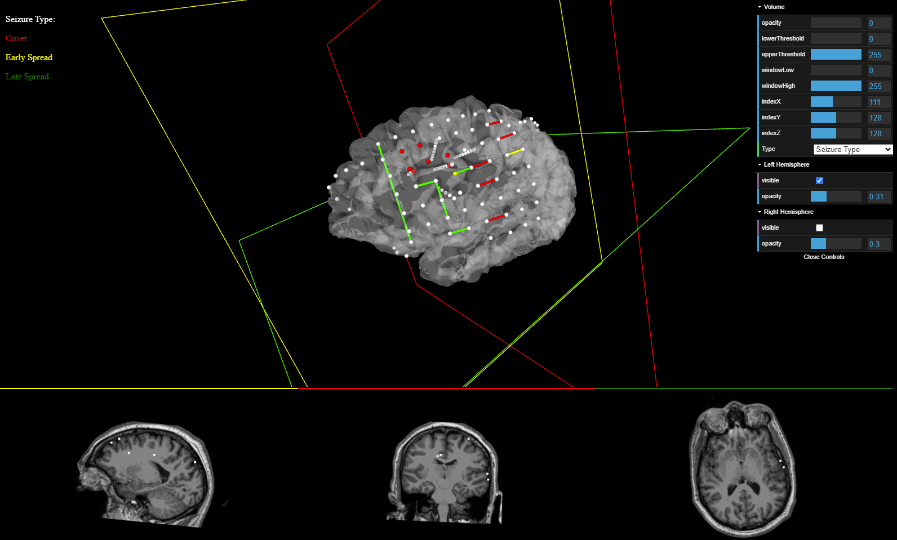
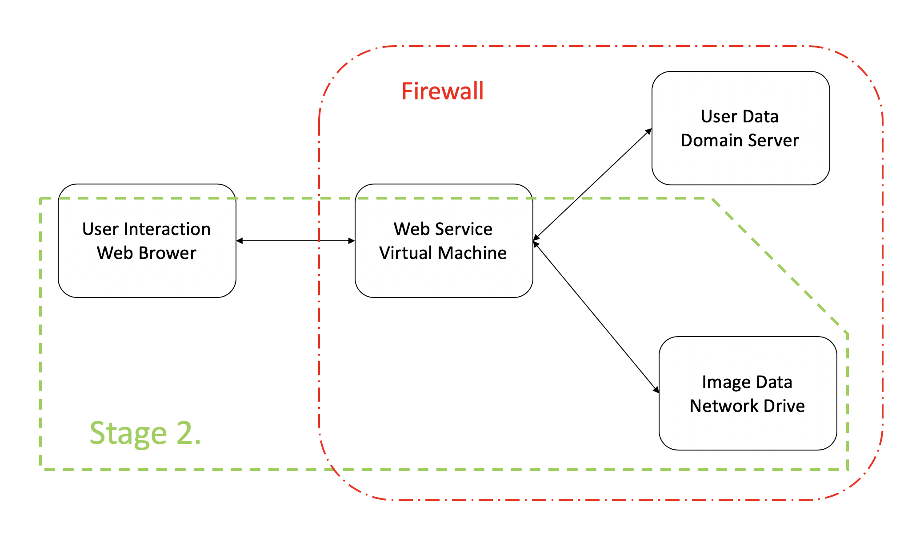
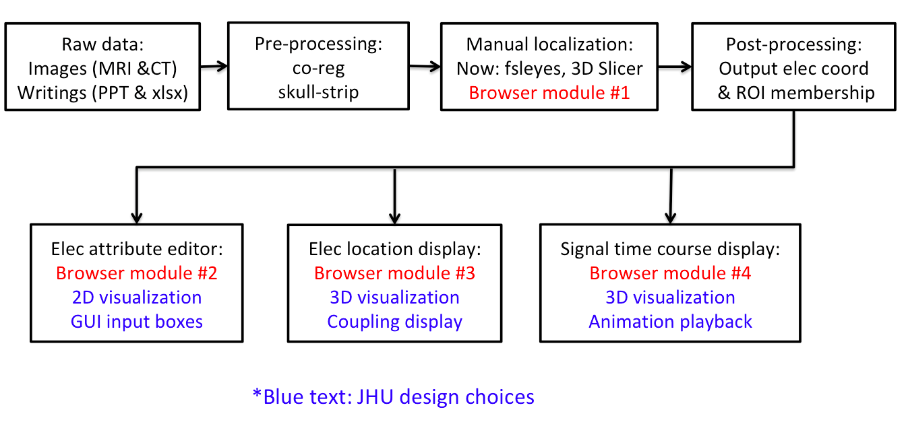
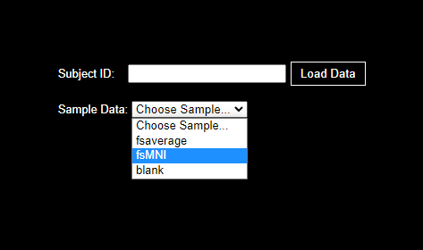
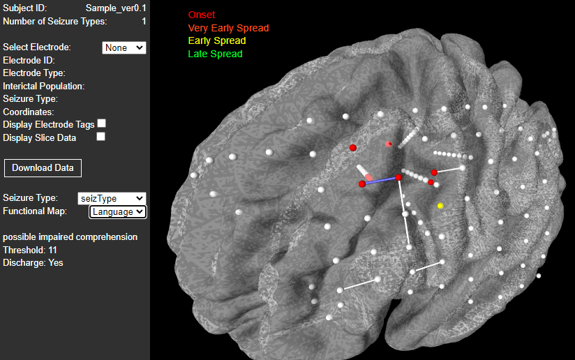
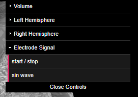
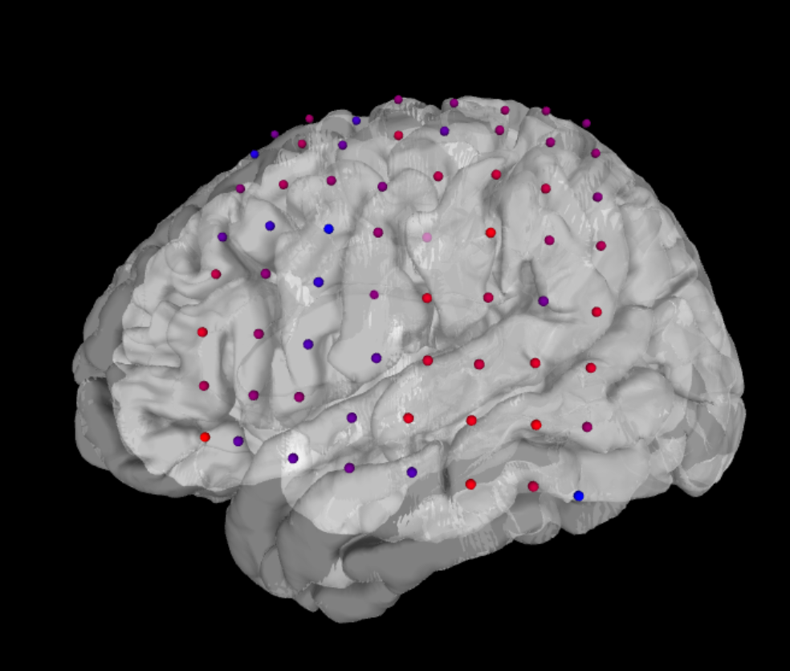
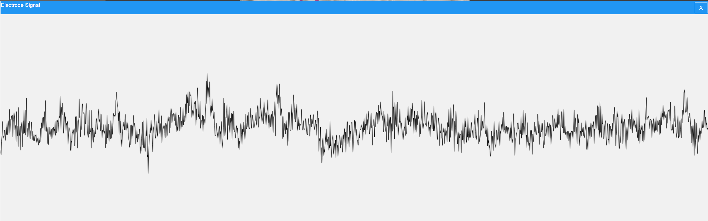

# ntools_browser
please add a more high-level documentation to your github if appropriate, this should tell ppl how to use the software or access it and describe it a little bit
**Web-based Electrode Visualization**

An add-on to [ntools_elec](https://github.com/HughWXY/ntools_elec), based on [XTK](https://github.com/xtk/X).

## User Walkthrough:
-  Go to the Github and search for github pages or click on the [link](https://ntoolsbrowser.github.io/).
-  On the loading page page you would select the patient data using the drop down menu shown below

-  After the loading page you can interact with the patient's data represented on a 3D brain mesh.

- 

![Electrode signal view]

The user can start the play back of all eletrode signals by pushing the 'play/stop' button under the 'Eletrode Signal' folder in the UI

The playback of the electrode signal is viewed as electrode color change. 
For any given time stamp in the playback the color red indicates the highest value at that time stamp while the color blue indicates the lowest value for the eletrode signal at that time stamp.
All other colors fall in between.

The user also has the ability to see the eletrode signal as a wave form by clicking on the 'sin wave' button

The user can scroll by moving the mouse to the bottom of the window and the horizontal scroll bar will appear. Or if there is a mouse pad drag 2 fingers on the mouse pad to scroll left or right the viewing window on the electrode signal.

As the scrolling of the sin wave happens the 3D view will update the electrode colors to the current scrolled to time stamp.

For the user to see the next electrode signal as a 'sin wave', he/she must press the arrow down on the keyboard to move to the next signal wave. Pressing arrow up displays the previous signal wave.

## Walkthrough for developers

