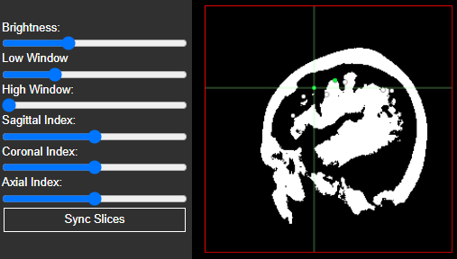

# N-Tools Browser
<!-- please add a more high-level documentation to your github if appropriate, this should tell ppl how to use the software or access it and describe it a little bit -->
**Web-based Electrode Visualization**

<!-- An add-on to [ntools_elec](https://github.com/HughWXY/ntools_elec), based on [XTK](https://github.com/xtk/X). -->

An update of the original [N-Tools Browser](https://github.com/jingyunc/ntools_browser), based on [XTK](https://github.com/xtk/X).

## User Walkthrough

Go to the Github and search for github pages or click on this [link](https://ntoolsbrowser.github.io/).  

For demoing, we have three samples to choose from using the drop down menu shown below


After the loading page you can interact with the patient's data represented on a 3D brain mesh.

<!---->


Electrodes can be selected by either clicking with the mouse, or using the 'Select Electrode' menu. Different functional mappings and seizure types can be selected with the 'Seizure Type' and 'Functional Map' menus.

## 2D Slice Renderers


The 2D slice renderers at the bottom of the screen can be controlled as follows:

- **Click+Drag** to move the slices to a different location
- **Scroll Wheel** to cycle between images
- **Ctrl+Scroll Wheel** to change image size
- **Double Click** to reset them back to their original position and size

## 2D Slice Editing

- To adjust the brigtness and  different axis of the 2d  slices you can use the slider at the bottom left side of your screen 




<!-- ### Electrode editing attribute:
- To edit the attribute or to mark the electrodes according to the elipsey level. Do right click of the mouse to get the table for updation of seziure type or electrode type -->

<!--  -->

<!-- ### Electrode signal view: -->


## Electrode and Functional Map Editing


The edit menu is activated by right clicking an electrode. The menu can be moved by clicking and dragging. At this time, the user must ensure that a functional mapping category is selected from the menu on the left panel. Left clicking on a new electrode will close the edit menu.

## Electrode Signal View

The user can start the play back of all electrode signals by pushing the 'play/stop' button under the 'Electrode Signal' folder in the UI.


<!---->


The playback of the electrode signal is viewed as electrode color change. 
For any given time stamp in the playback the color red indicates the highest value at that time stamp while the color blue indicates the lowest value for the electrode signal at that time stamp.
All other colors fall in between.


The user also has the ability to see the electrode signal as a wave form by clicking on the 'sin wave' button


The user can scroll by moving the mouse to the bottom of the window and the horizontal scroll bar will appear. Or if there is a mouse pad drag 2 fingers on the mouse pad to scroll left or right the viewing window on the electrode signal.

As the scrolling of the sin wave happens the 3D view will update the electrode colors to the current scrolled to time stamp.

For the user to see the next electrode signal as a 'sin wave', he/she must press the arrow down on the keyboard to move to the next signal wave. Pressing arrow up displays the previous signal wave.

## Instructions For Using N-Tools With Your Own Data

Those who wish to adapt N-Tools Browser for their own use will first need to download the repository. This can be done either by downloading the repository as a zip file or using:

    $ git clone https://github.com/ntoolsbrowser/ntoolsbrowser.github.io.git

You will need the following files:

1. A NIfTI (.nii) file, for the patient brain scan.
2. Two .pial meshes, for the left and right hemispheres.
3. A JSON file containing the coordinates and electrode IDs for the patient. An example of a JSON can be found [here](https://github.com/ntoolsbrowser/ntoolsbrowser.github.io/blob/main/data/blank/JSON/blank.json).
4. A `.edf` containing electrode signal data.

To convert the `.edf` into a signal header json and `.bin` file, you can run the following script found in the [preprocessing folder](https://github.com/ntoolsbrowser/ntoolsbrowser.github.io/tree/main/preprocessing/edfToJson.py).

    $ python edfToJson.py myFile.edf

A JSON for the electrode IDs and coordinates can be generated by hand or from existing data. The [preprocessing folder](https://github.com/ntoolsbrowser/ntoolsbrowser.github.io/tree/main/preprocessing/edfToJson.py) contains many examples for transforming data from `.txt` and `.xlsx` files. For example, if one has a `.txt` file containing entries such as 
```
id1 xCoor1 yCoor1 zCoor1
id2 xCoor2 yCoor2 zCoor2

...

idN xCoorN yCoorN zCoorN
```
the script [`genblank.py`](https://github.com/ntoolsbrowser/ntoolsbrowser.github.io/tree/main/preprocessing/edfToJson.py) can create a JSON file for the coordinates.

    $ python genblank.py myFile.txt

Similar simple scripts can be created for other file formats, such as `.csv`

### Option 1. Place your files into the local project directory as so.


Replace 'subject' with the actual subject ID.

```
data
└───subject
    └───edf
    |   | subject_signal_header.json
    |   └───signals
    |       | subject.bin
    └───JSON
    |   | subject.json
    └───meshes
    |   | subject_lh.pial
    |   | subject_rh.pial
    └───volume
        | subject_T1.nii
```
### Option 2. Update the URLs in [`main.js`](https://github.com/ntoolsbrowser/ntoolsbrowser.github.io/blob/main/main.js) and [`electrodes.js`](https://github.com/ntoolsbrowser/ntoolsbrowser.github.io/blob/main/js/electrodes.js)

Currently, the URLs in these files are pointing to files in NYU's server. If you have your own URL where you store files, this can be easily changed.

For file naming conventions this way, we have worked to comply to the [BIDS specification](https://bids-specification.readthedocs.io/en/stable/01-introduction.html). The naming conventions we have used are as follows:

- `?bids=ana&file=sub-subject_freesurferleft.pial`
- `?bids=ana&file=sub-subject_freesurferright.pial`
- `?bids=ana&file=sub-subject_preoperation_T1w.nii`
- `?bids=ieeg&file=sub-subject_ntoolsbrowser.json`
- `?bids=ieeg&file=sub-subject_functionalmapping.json`
- `?bids=ieeg&file=sub-subject_functionalmapping.bin`
